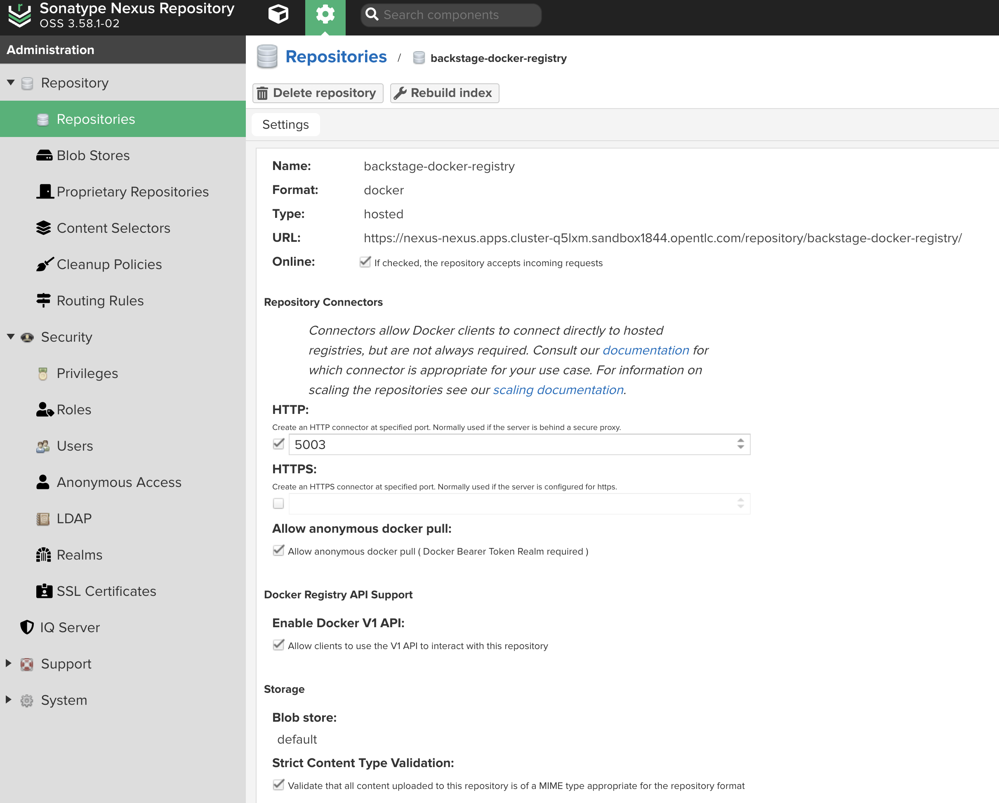
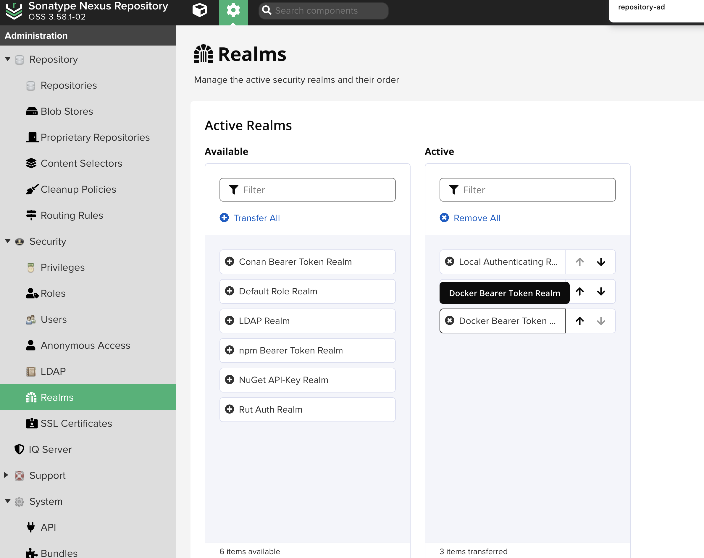
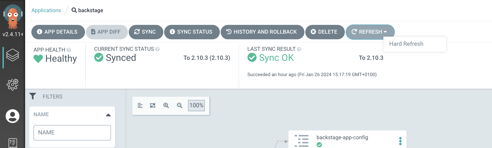
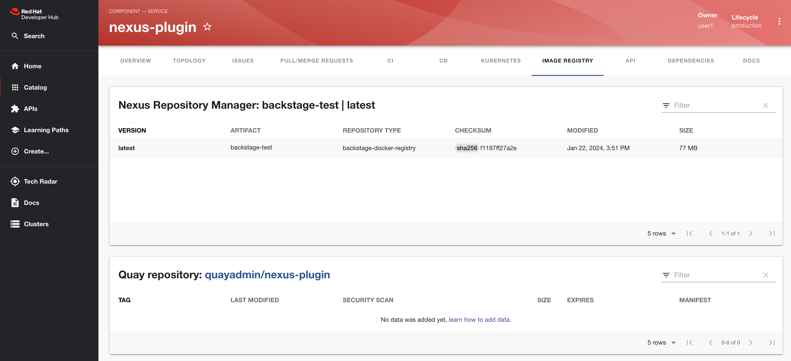

##
This repository is for demonstrating Red Hat Developer Hub `Dynamic Plugins` functionality.

In particular it demonstrates `Nexus Plugin`.

### Prerequisite
- Provision `Supercharge Developer Experience: Openshift & Red Hat Developer Hub Workshop` catalog item in `demo.redhat.com` 
- Log into your OpenShift Cluster as `admin` user

### Step by step guide

- Install the Nexus Repository - `cd nexus-operator`
  - Install the nexus operator - `oc apply -f nexus.yaml` This commands can take up to 5 min to finish.
  - Retrieve Nexus `admin` user password - `oc exec deploy/example-nexusrepo-sonatype-nexus -n nexus -- cat /nexus-data/admin.password` 
  - Retrieve Nexus URL: `oc get route nexus -n nexus -o jsonpath='{.spec.host}{"\n"}'`

- Create the Nexus Docker Registry
  - Open the Nexus URL (as obtained above) and login with the provided user (admin)  and password (as obtained above)
  - Change default password to something easier to remember, i.e. `password1!` and make sure to enable Anonymous Access as well
  - Create the Docker Registry as per this screenshot 
  - Port `5003` is important, as this repository precreates the `Service` and `Route` to listen on port `5003`. `Allow anonymous docker pull` is also crucial
  - Enable Docker Bearer Token Realm:
  
  - Write down the Docker Registry URL:
  ```
  export DOCKER_REGISTRY=`oc get route docker-registry -n nexus -o jsonpath='{.spec.host}{"\n"}'`
  ```
  - Test the Docker Registry URL (the URL in the screenshot is irrelevant, the Route URL always takes precedence) by executing :
  ``` 
  docker login $DOCKER_REGISTRY -u admin -p password1!
  ```
  - Build example Docker Image `docker build . -t backstage-test -f Containerfile`
  - Tag & Push 
  ```
  docker tag backstage-test $DOCKER_REGISTRY/backstage-test:latest
  docker push $DOCKER_REGISTRY/backstage-test:latest               
  ```


- Enable Nexus Dynamic Plugin in running Red Hat Developer Hub instance
  - Git clone the `janus-idp-gitops` repository:
   ```
   export GITLAB_ROUTE=`oc get route gitlab -n gitlab -o jsonpath='{.spec.host}{"\n"}'`
   git clone https://$GITLAB_ROUTE/gitops/janus-idp-gitops.git
   ```
- Enable the nexus plugin in `janus-idp-gitops/charts/backstage/backstage-values.yaml`:

```yaml
      - package: ./dynamic-plugins/dist/janus-idp-backstage-plugin-nexus-repository-manager
        disabled: false
```
- Configure the nexus plugin in `backstage-values.yaml -> upstream.backstage.extraEnvVars`:
 ```yaml
     extraEnvVars:
      - name: NEXUS_REPOSITORY_MANAGER_URL
        value: "https://$DOCKER_REGISTRY" //substitute with real value, https:// is required!
      - name: NEXUS_REPOSITORY_MANAGER_SECURE
        value: "false"
 ```

- Git commit & git push
- At this point, you need to log in to ArgoCD and manually request a sync of Backstage gitops repository.
  - Locate the ArgoCD server URL via following command `oc get route argocd-server -n openshift-gitops`
  - Login with `admin` user
  - Locate `backstage` application and click `Hard Refresh` as shown in the pic below
   
   - This will cause Backstage pod to restart with the new changes applied. The restart process takes couple of minutes to complete due to processing of dynamic pligins
- Login to Backstage and create a new component
- Locate the component in gitlab and add following annotation in `catalog-info.yaml`:
```yaml
metadata:
  annotations:
    nexus-repository-manager/docker.image-name: backstage-test
    nexus-repository-manager/docker.image-tag: latest
```
- Once done, open the component in the Backstage console and if configured correctly, you should see following content under `Image Registry` tab:


### Conclusion

This repository shows how Dynamic Plugins can be used in Red Hat Developer Hub (RHDH). Enabling and configuring of the plugin happens via gitops styled configuration and does not require rebuild of the backstage images. RHDH bundles all of the supported plugins with its distribution locally and they can be disabled/enabled on the fly. Even remote plugins (which sits outside of the local distribution) can be enabled/disable dynamically, but this is out of scope of this repository.