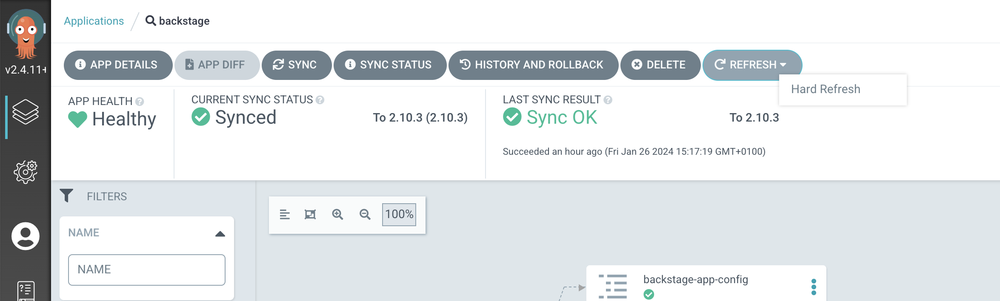
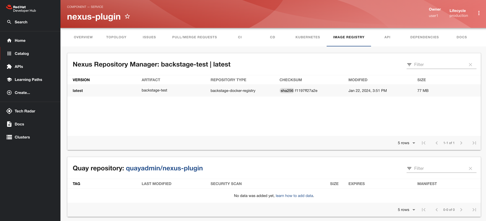

## Red Hat One - Bonus Lesson
If you are reading this you are attending `Redefining Developer Efficiency` lab at Red Hat One and you are probably interested in Red Hat Developer Hub (RHDH) Dynamic Plugins feature.

This is a one of the key differentiator between productized RHDH and upstream Backstage project which lacks this feature. This README offers a complete walkthrough through enabling one specific dynamic plugin - `Nexus Repository Manager`.

Adding a "normal" (static) plugin is a tedious process which requires a complete Backstage image rebuild (which is not an easy task!). At the time of writing (1/2024) Red Hat Developer Hub ships 47 plugins out of the box alongside its image. Vast majority of those are `disabled` out of the box. But since they are all written as dynamic plugins, enabling them is easy and does not require image rebuild. See following list of steps which highlights differences between using Backstage with static plugins and Red Hat Developer Hub enriched with Dynamic Plugins:

1. ~~Install NPM into codebase~~
2. ~~Change code to use the NPM~~
3. ~~Commit, Push, Merge~~
4. ~~Rebuild~~
5. ~~Release~~
6. Change configuration
7. Commit, Push, Merge
8. Deploy

Only steps 6/7/8 are required when you want to enable Dynamic Plugin using RHDH. Let's take a closer look at these steps in context of enabling Nexus dynamic plugin.

## Step By Step Guide

You need to be logged in as `admin` user for the below steps to work. Nexus Repository, with the accompanied Docker Registry and example Docker Image  has been already set up for you.

- RHDH instance on this cluster is installed via ArgoCD Application and its GitOps repository is stored in a GitLab repository.
- Locate GitLab URL 
    ```bash
   export GITLAB_ROUTE=`oc get route gitlab -n gitlab -o jsonpath='{.spec.host}{"\n"}'
   ```
- Clone Backstage GitOps repository
  ```bash
  git clone https://$GITLAB_ROUTE/gitops/janus-idp-gitops.git    
  ```
- Enable Nexus plugin by adding following configuration in `backstage-values.yaml` file
   ```yaml
   global:
     dynamic:
       plugins:
         - package: ./dynamic-plugins/dist/janus-idp-backstage-plugin-nexus-repository-manager
           disabled: false   
        ....   
    upstream:
      backstage:
        extraEnvVars:
          - name: NEXUS_REPOSITORY_MANAGER_URL
            value: "https://docker-registry-nexus.apps.cluster-ztblf.sandbox3018.opentlc.com"
          - name: NEXUS_REPOSITORY_MANAGER_SECURE
            value: "false"         
   ```  
- **Don't change the Nexus URL! It has been setup only on a single cluster and it does not exist on student cluster!** 
- Git Commit & Git Push as `user1`
- At this point we need to force ArgoCD Sync for our recent change. This is required due to the fact our values file is configured as a remote file and ArgoCD by default does not track changes in remote files
- Log into the following ArgoCD instance using `admin` user
  ```bash
  oc get route argocd-server -n openshift-gitops -o jsonpath='{.spec.host}{"\n"}' 
  ```
 - Locate `backstage` Application and select `Hard Refresh` as shown in the picture below:
      
- This will force the backstage pod to restart with our new configuration changes applied. The restart process usually takes a couple of minutes - this is because init container processes every plugin on Backstage pod startup.
- Log in to the Backstage instance and create a catalog entry based on the provided `Securing a Quarkus Service Software Supply Chain` template.
- Locate this new entry in the corresponding GitLab repository and apply following changes into to `catalog-info.yaml` which is located at the root of your repository:
```yaml
metadata:
  annotations:
    nexus-repository-manager/docker.image-name: backstage-test
    nexus-repository-manager/docker.image-tag: latest
```
 - !! Don't change the annotation values, there is only one example image provided for this excercise and its name and tag is `backstage-test:latest`   
 - Save the changes in `catalog-info.yaml` file
 - Documentation on the supported annotation values for nexus plugin can be found here:
   - https://github.com/janus-idp/backstage-plugins/blob/main/plugins/nexus-repository-manager/ANNOTATIONS.md
- Locate your new component in the Backstage UI and click `Image Registry` tab. If everything has been set up correctly you should see:
  
  - Note that it might take couple of minutes for changes to take affect. Consider also trying Anonymous Browser window

## Conclusion
In this repository we have successfully demonstrated how we can leverage RHDH Dynamic Plugins feature. It's a key differentiator from the upstream Backstage project and if you ever had to add a new static plugin to your Backstage instance you understand how drastically simplified the process of working with Dynamic Plugins is. This is a powerful RHDH feature, so let's make sure our customers are aware of it!


